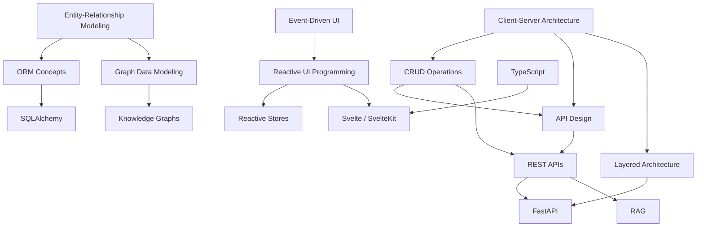

# Knowledge Assessment Report

**Project**: WellBegun
**Date**: 2026-03-05

---

## User Profile

| Field | Value |
|-------|-------|
| Role | Data scientist / researcher |
| Experience | 10+ years |
| Primary Skills | Python, data analysis, statistical modeling, scientific computing |
| Learning Goals | Full-stack web development, software architecture, FastAPI, Svelte/SvelteKit, SQLAlchemy, knowledge graphs |

As a data scientist with over a decade of experience, you have deep expertise in Python and data workflows. WellBegun was built primarily with AI assistance (Claude Code), which means many technology choices and architectural patterns were made by the AI rather than selected from your existing toolkit. This updated assessment adds high-level architectural concepts that are programming-language agnostic, providing a foundation before diving into specific technologies.

---

## Technology Inventory

### Languages

| Technology | Version | Project Usage | Relevance | Familiarity | Gap? |
|------------|---------|--------------|-----------|-------------|------|
| Python | 3.14+ | Backend API, services, data models | core | advanced | No |
| TypeScript | 5.x | Frontend components, stores, API client | core | beginner | Yes |

### Frameworks

| Technology | Version | Project Usage | Relevance | Familiarity | Gap? |
|------------|---------|--------------|-----------|-------------|------|
| FastAPI | 0.115+ | REST API server, routing, middleware | core | heard | Yes |
| Svelte/SvelteKit | 5.x | Frontend UI framework, routing, SSR | core | beginner | Yes |

### Libraries

| Technology | Version | Project Usage | Relevance | Familiarity | Gap? |
|------------|---------|--------------|-----------|-------------|------|
| SQLAlchemy | 2.x | ORM, database models, queries | core | beginner | Yes |
| httpx | 0.27+ | Async HTTP client for Ollama LLM calls | supporting | beginner | No |
| Pydantic | 2.x | Request/response validation schemas | significant | beginner | No |

### Architectural Concepts (NEW)

| Concept | Project Usage | Relevance | Familiarity | Gap? |
|---------|--------------|-----------|-------------|------|
| Client-Server Architecture | Frontend/backend separation over HTTP | core | heard | Yes |
| CRUD Operations | Every entity follows Create/Read/Update/Delete | core | heard | Yes |
| ORM (Object-Relational Mapping) | SQLAlchemy maps classes to DB tables | core | heard | Yes |
| Layered Architecture | Routers -> services -> models -> database | core | beginner | Yes |
| Reactive UI Programming | Svelte auto-renders on state changes | core | beginner | Yes |
| Entity-Relationship Modeling | Entities with typed relationships | significant | heard | Yes |
| API Design | Standardized endpoints per entity type | core | beginner | Yes |
| Event-Driven UI | Component events, dispatch, store broadcasts | significant | heard | Yes |
| Graph Data Modeling | Nodes and edges for knowledge representation | significant | beginner | Yes |

### Patterns & Concepts

| Technology | Project Usage | Relevance | Familiarity | Gap? |
|------------|--------------|-----------|-------------|------|
| REST APIs | Client-server communication pattern | core | beginner | Yes |
| Reactive Stores | Frontend state management with Svelte stores | significant | heard | Yes |
| Knowledge Graphs | Semantic triples linking entities | significant | beginner | Yes |
| RAG | Retrieval-Augmented Generation for assistant | supporting | beginner | Yes |

---

## Knowledge Gaps

The following technologies represent knowledge gaps where learning material has been generated:

| # | Technology | Category | Familiarity | Relevance | Priority |
|---|-----------|----------|-------------|-----------|----------|
| 1 | Client-Server Architecture | concept | heard | core | critical |
| 2 | Entity-Relationship Modeling | concept | heard | significant | critical |
| 3 | CRUD Operations | concept | heard | core | critical |
| 4 | ORM (Object-Relational Mapping) | concept | heard | core | critical |
| 5 | Event-Driven UI | concept | heard | significant | important |
| 6 | API Design | concept | beginner | core | critical |
| 7 | Layered Architecture | pattern | beginner | core | critical |
| 8 | Reactive UI Programming | concept | beginner | core | important |
| 9 | Graph Data Modeling | concept | beginner | significant | important |
| 10 | REST APIs | concept | beginner | core | critical |
| 11 | FastAPI | framework | heard | core | critical |
| 12 | TypeScript | language | beginner | core | important |
| 13 | SQLAlchemy | library | beginner | core | important |
| 14 | Svelte & SvelteKit | framework | beginner | core | important |
| 15 | Reactive Stores | pattern | heard | significant | important |
| 16 | Knowledge Graphs | concept | beginner | significant | nice-to-have |
| 17 | RAG | concept | beginner | supporting | nice-to-have |

---

## Recommended Learning Path

### Course Order

**Foundation (Architecture-first, language-agnostic):**
1. **Client-Server Architecture** (~20 min) — How frontend and backend work as independent applications
2. **Entity-Relationship Modeling** (~20 min) — Designing data models with entities and relationships
3. **CRUD Operations** (~15 min) — The universal Create/Read/Update/Delete pattern
4. **ORM (Object-Relational Mapping)** (~20 min) — Bridging objects and database tables
5. **Event-Driven UI** (~15 min) — How user interactions flow through components
6. **API Design** (~20 min) — Designing endpoints, contracts, and status codes
7. **Layered Architecture** (~20 min) — Separating concerns into code layers
8. **Reactive UI Programming** (~15 min) — Automatic UI updates when data changes
9. **Graph Data Modeling** (~15 min) — Representing knowledge as nodes and edges

**Technology-specific:**
10. **REST APIs & HTTP Fundamentals** (~25 min) — HTTP-based client-server communication
11. **FastAPI for Python Developers** (~30 min) — The framework powering WellBegun's API
12. **TypeScript Essentials** (~25 min) — Adding types to JavaScript for safer frontend code
13. **SQLAlchemy ORM** (~30 min) — Python ORM for database modeling
14. **Svelte & SvelteKit** (~30 min) — The reactive UI framework behind WellBegun's frontend
15. **Reactive Stores & State Management** (~20 min) — Sharing state across Svelte components
16. **Knowledge Graphs & Semantic Triples** (~20 min) — Linking entities with meaningful relationships
17. **RAG (Retrieval-Augmented Generation)** (~20 min) — Grounding LLM answers in your own data

**Total estimated time**: ~380 minutes
